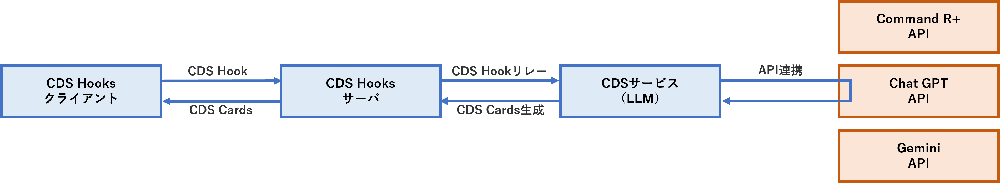
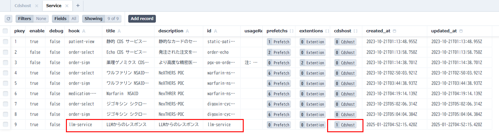
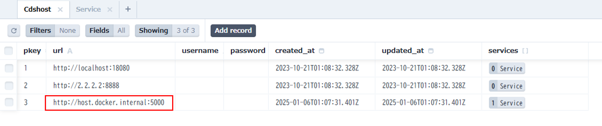
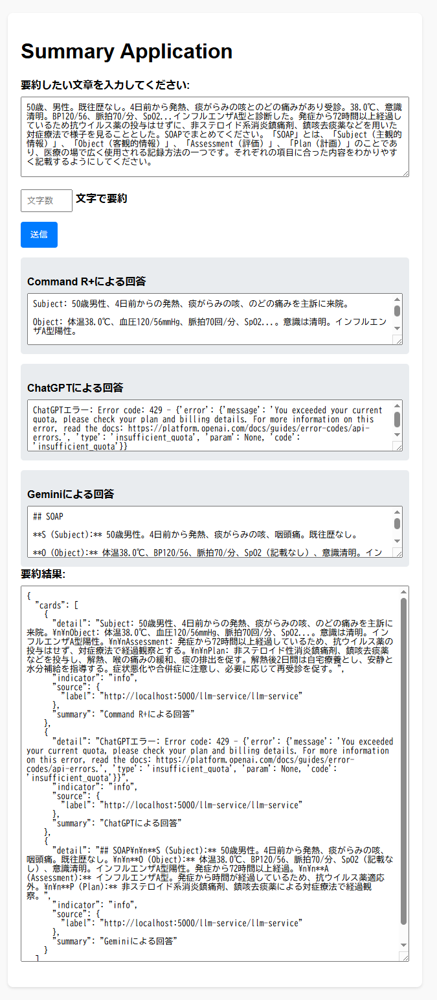

# CDS Hooks(プロトタイプ版)の活用事例

- CDS Hooks(プロトタイプ版)の活用事例として、LLM連携の新規サービスを作成し、CDS Hooks サーバへの追加方法を検証しました。

## CDS サービス（LLM）
- LLM に問い合わせを行うサービスを作成
- LLM は以下を採用
  - Command R+（Cohere）
  - ChatGPT（OpenAI）
  - Gemini（Google）
- CDS Hooks サーバから CDS Hook を受信し、Command R+ の API リクエストを生成して送信
- Command R+ のレスポンスから CDS Cards を生成し、CDS Hooks サーバへ送信
- PDDI CDS IG により、1リクエスト＝1レスポンスと定められているため、CDS サービスで複数の LLM サービスにリクエストを行い、結果を1つの Cards に各 LLM の結果を Card 配列としてレスポンスするよう実装



## CDS Hook 設定値
LLMのAPI仕様を考慮して、CDS Hookの設定値を以下のように定義しました。

| フィールド        |          | 必須 | 型     | 概要                                                        | 設定値         | 
| ----------------- | -------- | ---- | ------ | ----------------------------------------------------------- | -------------- | 
| hook              |          | 〇   | string | CDS Hooks トリガーイベント（order-sign等）                  | 「order-sign」 | 
| hookInstance      |          | 〇   | string | リクエストごとのUUID                                        | UUIDを設定     | 
| context           |          | 〇   | object | CDS Hooks トリガーイベント固有のコンテキストデータ          | 「context」    | 
|                   | question |      | string | LLMへの質問を設定【検証用に追加】                           | 質問内容を設定 | 
| prefetch          |          |      | object | context以外でCDSサービスが必要としたFHIRリソース            | 設定なし       | 
| fhirServer        |          |      | URL    | FHIRサーバーのベースURL（fhirAuthorization指定時、必須）    | 設定なし       | 
| fhirAuthorization |          |      | object | FHIRサーバアクセスのためのOAuth 2.0ベアラーアクセストークン | 設定なし       | 
|                   | 
## CDS Cards 設定値
LLMのAPI仕様を考慮して、CDS Cardsの設定値を以下のように定義しました。

| フィールド |                   |            |             | 必須 | 型     | 概要                                                                                        | 設定値                             | 
| ---------- | ----------------- | ---------- | ----------- | ---- | ------ | ------------------------------------------------------------------------------------------- | ---------------------------------- | 
| cards      |                   |            |             | 〇   | array  | Cardの配列                                                                                  | 「cards」                          | 
|            | summary           |            |             | 〇   | string | 要約メッセージ（140文字以内）                                                               | 「Command R+による回答」           | 
|            | detail            |            |             |      | string | 詳細情報                                                                                    | LLMからの回答を設定                | 
|            | indicator         |            |             | 〇   | string | 緊急性/重要性（info/warning/critical）                                                      | 「info」                           | 
|            | source            |            |             | 〇   | object | このカード情報の出典情報                                                                    | 「source」                         | 
|            |                   | label      |             | 〇   | string | このカードに表示される情報のソースとして表示するラベル                                      | Command R+ APIのｴﾝﾄﾞﾎﾟｲﾝﾄ | 
|            |                   | url        |             |      | URL    | ソースの情報を提供した組織やデータセットの詳細を知るための絶対URL                           | 設定なし                           | 
|            |                   | icon       |             |      | URL    | このカードのソースのアイコンへの絶対URL                                                     | 設定なし                           | 
|            | suggestions       |            |             |      | array  | 代替案（提案）の情報                                                                        | suggestions array 設定なし         | 
|            |                   | label      |             | 〇   | string | ラベル                                                                                      | 設定なし                           | 
|            |                   | uuid       |             |      | string | 一意の識別子（監査とログに仕様）                                                            | 設定なし                           | 
|            |                   | actions    |             |      | array  | オブジェクト配列、それぞれが提案されたアクションを定義                                      | 設定なし                           | 
|            |                   |            | type        | 〇   | string | アクションタイプ：create/update/delete                                                      | 設定なし                           | 
|            |                   |            | description | 〇   | string | 提案内容の説明                                                                              | 設定なし                           | 
|            |                   |            | resource    |      | object | type 属性に応じて、新規リソースまたはリソースの id を指定                                   | 設定なし                           | 
|            | selectionBehavior |            |             |      | string | 代替案（提案）の意図する選択動作を記述                                                      | 設定なし                           | 
|            | links             |            |             |      | array  | 追加情報を得る、または意思決定のためのアプリのリンク                                        | links array 設定なし               | 
|            |                   | label      |             | 〇   | string | ラベル                                                                                      | 設定なし                           | 
|            |                   | url        |             | 〇   | URL    | ユーザーが追加情報を得るため、または意思決定のために実行する可能性のあるアプリへのリンクURL | 設定なし                           | 
|            |                   | type       |             | 〇   | string | absolute：絶対URL、smart：SMART アプリ起動 URL                                              | 設定なし                           | 
|            |                   | appContext |             |      | string | リンクタイプが “smart ”の場合のSMARTアプリ 起動パラメータ                                 | 設定なし                           | 
|            | 

## CDS Hooks サーバの設定
- 接続先を管理している Prisma（DB）に Service と Cdshost を追加
- [Prisma Studio 起動方法](../cds-server-next-docker/docs/extention01.md)

## CDS Hooks サーバの設定（Prisma 設定）
### サービスの追加


- クライアントからのエンドポイントを追加、リレー先の CDS サービスを指定
  - 例）CDS Hooks サーバ: `http://localhost:3000`、エンドポイント: `http://localhost:3000/llm-service(hook)/llm-service(id)`


### ホストの追加


  - 例）CDS サービスサーバ: `http://localhost:5000`、エンドポイント: `http://localhost:5000/llm-service(hook)/llm-service(id)`
  - Docker 構築の場合はローカル構築: `http://localhost:18080`


## CDS Hooks クライアント
- PDDI CDS IG により、1リクエストに対するレスポンスは1 Cards と定められているため、CDS サービス内で複数の LLM サービスにリクエストを行い、結果を1 Cards 内に複数 Card 配列として作成し、レスポンスを行うように実装しました。
- CDS サービスからリクエストする LLM サービス
  - Command R+（Cohere）
  - ChatGPT（OpenAI）
  - Gemini（Google）



## CDS Hooks クライアント（回答例）
### Command R+ による回答
```
Subject: 50歳男性、4日前からの発熱、痰がらみの咳、のどの痛みを主訴に来院。
Object: 体温38.0℃、血圧120/56mmHg、脈拍70回/分、SpO2...。意識は清明。インフルエンザA型陽性。
Assessment: 発症から72時間以上経過しているため、抗ウイルス薬の投与はせず、対症療法で経過観察とする。
Plan: 非ステロイド性消炎鎮痛剤、鎮咳去痰薬などを投与し、解熱、喉の痛みの緩和、痰の排出を促す。
解熱後2日間は自宅療養とし、安静と水分補給を指導する。症状悪化や合併症に注意し、必要に応じて再受診を促す。
```

### ChatGPT による回答
```
ChatGPTエラー: Error code: 429 - {'error': {'message': 'You exceeded your current quota, please check your plan and billing details.', 'type': 'insufficient_quota'}}
```

### Gemini による回答
```
## SOAP
**S (Subject):** 50歳男性。4日前から発熱、痰がらみの咳、咽頭痛。既往歴なし。
**O (Object):** 体温38.0℃、BP120/56、脈拍70/分、SpO2（記載なし）、意識清明。インフルエンザA型陽性。発症から72時間以上経過。
**A (Assessment):** インフルエンザA型。発症から時間が経過しているため、抗ウイルス薬適応外。
**P (Plan):** 非ステロイド系消炎鎮痛剤、鎮咳去痰薬による対症療法で経過観察。
```

## CDS Hooks クライアントのセットアップ
- [CDS Hooks クライアントのセットアップ](./cds-hooks-client(python版)/README.md)

- [CDS サービスのセットアップ](./LLMService/README.md)

<br><br><br>
