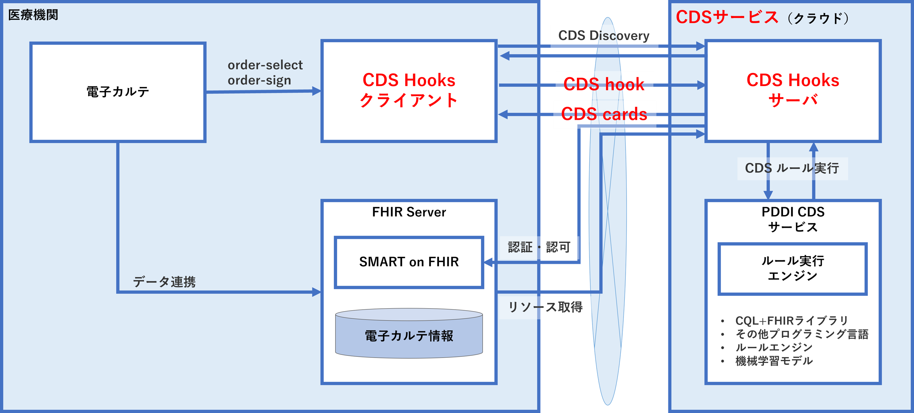

# CDS-HOOKS-SERVER(NeXEHRS-POC)
- このプロジェクトは「CDS Hooks(プロトタイプ版)実証」[NeXEHRS-POC](https://www.nexehrs-cpc.jp/)によるCDS実装検証モデルです。
- HL7 FHIR (Fast Healthcare Interoperability Resources) のCDS (Clinical Decision Support)Hooks 仕様は臨床支援情報をリアルタイムで提供する仕組みです。臨床支援情報の送受信はHL7 FHIRリソースを用いて行います。
- CDS Hooks の導入により、様々な情報源からのデータがリアルタイムで統合され、医療提供者が患者の状態を正確に評価し、最適な治療方針を迅速に決定できるようになります。
- 本実証では、CDS Hooks を用いたシステムを電子カルテシステムから利用できるようなシステム環境の実現を目的として、CDS Hooks サービスのプロトタイプ開発を行いました。
- CDS Hookは、ベンダーに依存しないリモート意思決定支援標準です。 このリポジトリは、CDS Hooks プロジェクトの仕様と Web サイトの両方として機能します。

<br>

# システム構成
- CDS-Hooks サービスの実装アーキテクチャーCDS Hooks サービスとそれを利用する電子カルテシステムの関係は図１で示すように、電子カルテがCDS Hooks を呼び出すクライアントモジュールを呼び出します。
- このモジュールは必要なFHIR リソースをFHIR サーバから取得してクラウド上のCDS サービスを提供するCDS Hooks サーバを呼び出します。

<center></center> 

- CDS Hooks サーバは該当するサービスに対応するCDS サービスモジュールに依頼し、同モジュールはルールを実行するなどによりレスポンスを返却する。このレスポンスはCDS Hooks サービスによりCDS Response 形式としてクライアントに返却される。
- 今回の実証にあたっては、**CDS Hooks クライアント**、**CDS Hooks サーバ**、**PDDI CDS サービス**を独立して開発し、最後にこれらを相互接続して検証することとした。これにより、CDS HooksクライアントからCDS Hooksサービスのインターフェースを共通化すること、および他のCDSサービスの拡張に柔軟に対応できるシステム構成を実現した。

<br>

### 処理フロー
<center></center> 

1. 電子カルテ：CDS Hooks クライアントを呼び出し
1. CDS Hooks クライアント：リクエストのJSONを作成（その際に必要となるFHIRリソースをFHIRサーバから取得）
1. CDS Hooks クライアント：CDS Hooksサーバにリクエスト送信
1. CDS Hooksサーバ：PDDI CDS サービス呼び出し
1. PDDI CDS サービス：診療診断支援のルール実行
1. PDDI CDS サービス：サーバにCard形式で実行結果を送信
1. PDDI CDS サービス： CDS Hooksクライアントへレスポンス送信

<br>

## [CDS Hooks クライアント](./cds-hooks-client/README.md)
- 動作環境
- フォルダ構成
- 事前準備
- 実行コマンド


## [CDS Hooksサーバ](./cds-server-next-docker/README.md)
- CDSHOOKサーバの開始方法
- 基本仕様・機能概要
- API仕様書
	- 共通仕様
	- /cds-service
	- /order-select
	- /order-sign

## [PDDI CDS サービス](./pddi-cds-service-proto/README.md)
- PDDI CDSサービス（Docker版）のインストール
	- 事前準備
	- インストール手順
- リクエストAPI
	- アクセスURL
	- リクエストヘッダ
	- リクエストボディ


---

> [!CAUTION]
>2024-05-10 17:10:23
> Next.js サーバー アクションでサーバー側リクエスト フォージェリ (SSRF) の脆弱性がセキュリティによって特定されました。
> 過去にダウンロードさあれた方はNextバージョンを 14.1.1以降にアップデートする事により解消できます。

Nextバージョンアップ方法
```bash
※ cds-hooks-proto/cds-server-next-docker/cds-hook-server/へ移動します。
>cd cds-hooks-proto/cds-server-next-docker/cds-hook-server/

※ 下記のコマンドでアップデートを実行します。これにより最新版へアップグレートされます。
>npm i next@latest

[確認方法]
cds-hooks-proto/cds-server-next-docker/cds-hook-server/package.jsonを確認して13行目あたりにあるnextと書かれた行でバージョンが確認できます。
例："next": "^14.2.3",
```
<br>

***

# CDS Hooks 仕様
- [CDS （Clinical Decision Support） Hooksの仕様](https://cds-hooks.hl7.org/)は、電子カルテ等の医療情報システムと、CDSサービス間のデータ交換手法を定めた規約であり、HL7協会が臨床診断支援のための仕様として公開されています。
- 臨床診断支援情報をリアルタイムで提供する仕組みであり、 HL7 FHIRリソースの利用を前提として定義されており、インターフェイスは、RESTful APIを用いています。

## CDS Hooks 基本コンポーネント
　　本実証のシステム構成を参考に以下のコンポーネントでCDS Hooksは構成されます。
<center></center> 

- [CDS hook【リクエスト】](#cds-hookリクエスト)：CDSサービスへのリクエスト
- [CDS cards【レスポンス】](#cds-cardsレスポンス)：CDSサービスからのレスポンス
- CDS Hooks クライアント：CDSサービスの利用側
- CDS サービス：CDSサービスの提供側


### CDS hook【リクエスト】
　　電子カルテの操作に関連したトリガーイベントが定義されています。

- patient-view
    - 患者情報を開いたタイミングでのCDS呼び出し<br>電子カルテであれば、患者のカルテを開いたタイミングなど
- order-select
    - オーダー入力中のCDS呼び出し<br>処方オーダーであれば、薬剤を選択したタイミングなど
- order-sign
    - オーダー確定直前のCDS呼び出し<br>処方オーダーであれば、薬剤、用法、用量などを一通り入力したタイミングなど
- appointment-book
    - 患者の予約オペレーション開始〜終了までのタイミングでのCDS呼び出し
- encounter-start
    - 患者が来院したタイミングでのCDS呼び出し
- encounter-discharge
    - 患者の退院オペレーション開始〜終了までのタイミングでのCDS呼び出し<br>退院時アウトカムが達成できているかの評価にCDSが介入するなど

#### リクエスト仕様
　　リクエストは、以下の入力フィールドを持つJSONドキュメントで構成されます。
　　
| フィールド        | 必須 | 型     | 概要                                                        | 
| ----------------- | ---- | ------ | ----------------------------------------------------------- | 
| hook              | 〇   | string | CDS Hooks トリガーイベント（order-sign等）                  | 
| hookInstance      | 〇   | string | リクエストごとのUUID                                        | 
| context           | 〇   | object | CDS Hooks トリガーイベント固有のコンテキストデータ          | 
| prefetch          |      | object | context以外でCDSサービスが必要としたFHIRリソース            | 
| fhirServer        |      | URL    | FHIRサーバーのベースURL（fhirAuthorization指定時、必須）    | 
| fhirAuthorization |      | object | FHIRサーバアクセスのためのOAuth 2.0ベアラーアクセストークン | 

- CDSサービスのエンドポイントは、ベースURLと個々のサービスIDから{baseUrl}/cds-services/{service.id}のように構築
- CDSクライアントは、JSONドキュメントをCDSサービスにPOST

**リクエスト例**

```bash
{
  "hook": "order-sign",
  "hookInstance": "9d02e4d7-2d5b-492f-8f77-ce36dda0647d",
  "context": {
    "userId": "Practitioner/example",
    "patientId": "patient-warfarin-nsaid-under65-prefetch",
    "draftOrders": {
      "resourceType": "Bundle",
      "type": "collection",
      "entry": [
        {
          "fullUrl": "http://localhost:8080/fhirServer/MedicationRequest/medicationrequest-warfarin-nsaid-nsaid-context",
          "resource": {
            "resourceType": "MedicationRequest",
            "id": "medicationrequest-warfarin-nsaid-nsaid-context",
            "status": "active",
            "intent": "order",
            "category": [
              {
                "coding": [
                  {
                    "code": "outpatient"
                  }
                ]
              }
            ],
            "medicationCodeableConcept": {
              "coding": [
                {
                  "system": "http://www.nlm.nih.gov/research/umls/rxnorm",
                  "code": "197805",
                  "display": "Ibuprofen 400 MG Oral Tablet"
                }
              ]
            },
            "subject": {
              "reference": "Patient/patient-warfarin-nsaid-under65-prefetch"
            },
            "encounter": {
              "reference": "Encounter/warfarin-nsaid-prefetch"
            },
            "authoredOn": "2024-06-10",
            "_authoredOn": {
              "extension": [
                {
                  "url": "http://hl7.org/fhir/StructureDefinition/cqif-cqlExpression",
                  "valueString": "Today()"
                }
              ]
            },
            "dosageInstruction": [
              {
                "timing": {
                  "repeat": {
                    "frequency": 1,
                    "period": 1,
                    "periodUnit": "d"
                  }
                },
                "asNeededBoolean": false
              }
            ],
            "dispenseRequest": {
              "validityPeriod": {
                "extension": [
                  {
                    "url": "http://hl7.org/fhir/StructureDefinition/cqif-cqlExpression",
                    "valueString": "FHIR.Period { start: FHIR.dateTime { value: Today() }, end: FHIR.dateTime { value: Today() } }"
                  }
                ],
                "start": "2024-06-10",
                "end": "2024-06-10"
              },
              "numberOfRepeatsAllowed": 1,
              "expectedSupplyDuration": {
                "value": 90,
                "unit": "d"
              }
            }
          }
        }
      ]
    }
  },
  "prefetch": {
    "MedicationStatement": {
      "resourceType": "Bundle",
      "type": "searchset",
      "total": 1,
      "entry": [
        {
          "fullUrl": "http://localhost:8080/fhirServer/MedicationStatement/medicationstatement-warfarin-nsaid-warfarin-prefetch",
          "resource": {
            "resourceType": "MedicationStatement",
            "id": "medicationstatement-warfarin-nsaid-warfarin-prefetch",
            "status": "active",
            "category": {
              "coding": [
                {
                  "code": "outpatient"
                }
              ]
            },
            "medicationCodeableConcept": {
              "coding": [
                {
                  "system": "http://www.nlm.nih.gov/research/umls/rxnorm",
                  "code": "855295",
                  "display": "Warfarin Sodium 10 MG"
                }
              ]
            },
            "subject": {
              "reference": "Patient/patient-warfarin-nsaid-under65-prefetch"
            },
            "context": {
              "reference": "Encounter/warfarin-nsaid-prefetch"
            },
            "effectiveDateTime": "2024-06-10"
          }
        }
      ]
    },
    "Patient": {
      "resourceType": "Bundle",
      "type": "searchset",
      "total": 1,
      "entry": [
        {
          "fullUrl": "http://localhost:8080/fhirServer/Patient/",
          "resource": {
            "resourceType": "Patient",
            "id": "patient-warfarin-nsaid-under65-prefetch",
            "gender": "male",
            "birthDate": "1982-01-07"
          }
        }
      ]
    },
    "MedicationRequest": {
      "resourceType": "Bundle",
      "type": "searchset",
      "total": 1,
      "entry": [
        {
          "fullUrl": "http://localhost:8080/fhirServer/MedicationRequest/medicationrequest-warfarin-nsaid-aldosteroneantagonist-prefetch",
          "resource": {
            "resourceType": "MedicationRequest",
            "id": "medicationrequest-warfarin-nsaid-aldosteroneantagonist-prefetch",
            "status": "active",
            "intent": "order",
            "category": [
              {
                "coding": [
                  {
                    "code": "outpatient"
                  }
                ]
              }
            ],
            "medicationCodeableConcept": {
              "coding": [
                {
                  "system": "http://www.nlm.nih.gov/research/umls/rxnorm",
                  "code": "198223",
                  "display": "Spironolactone 50 MG Oral Tablet"
                }
              ]
            },
            "subject": {
              "reference": "Patient/patient-warfarin-nsaid-under65-prefetch"
            },
            "encounter": {
              "reference": "Encounter/warfarin-nsaid-prefetch"
            },
            "authoredOn": "2024-06-06",
            "_authoredOn": {
              "extension": [
                {
                  "url": "http://hl7.org/fhir/StructureDefinition/cqif-cqlExpression",
                  "valueString": "Today() - 10 days"
                }
              ]
            },
            "dosageInstruction": [
              {
                "timing": {
                  "repeat": {
                    "frequency": 1,
                    "period": 1,
                    "periodUnit": "d"
                  }
                },
                "asNeededBoolean": false
              }
            ],
            "dispenseRequest": {
              "validityPeriod": {
                "extension": [
                  {
                    "url": "http://hl7.org/fhir/StructureDefinition/cqif-cqlExpression",
                    "valueString": "FHIR.Period { start: FHIR.dateTime { value: Today() - 10 days }, end: FHIR.dateTime { value: Today() } }"
                  }
                ],
                "start": "2024-06-06",
                "end": "2024-06-10"
              },
              "numberOfRepeatsAllowed": 1,
              "expectedSupplyDuration": {
                "value": 90,
                "unit": "d"
              }
            }
          }
        }
      ]
    }
  }
}
```

### CDS Cards【レスポンス】
　　CDSサービスからのレスポンスは、**card**配列で表現され、各cardは以下の分類で定義されています。
- Information card
    - CDSクライアントの利用者が読むためのテキスト情報を返却する
- Suggestion card
    - 代替案（提案）の情報を返却する<br>CDSクライアントは、提案内容を受け入れるか否かを利用者に選択させ、受け入れる場合は提案内容を自動的に反映させるように実装する必要がある<br>（例: Ａ薬が処方されましたが、Ｂ薬の方が〇〇の理由で推奨されます。Ｂ薬に変更しますか？）
- Smart-app link card
    - SMARTアプリ（SMART仕様に準拠しているアプリ）のリンクを返却する<br>利用者に特定のビューを見せたい場合など

#### レスポンス仕様
　　レスポンスは、以下の入力フィールドを持つJSONドキュメントで構成されます。
　　
| フィールド |                   |            |             | 必須 | 型     | 概要                                                                                                  | 
| ---------- | ----------------- | ---------- | ----------- | ---- | ------ | ----------------------------------------------------------------------------------------------------- | 
| cards      |                   |            |             | 〇   | array  | Cardの配列                                                                                            | 
|            | summary           |            |             | 〇   | string | 要約メッセージ（140文字以内）                                                                         | 
|            | detail            |            |             |      | string | 詳細情報                                                                                              | 
|            | indicator         |            |             | 〇   | string | 緊急性/重要性（info/warning/critical）                                                                | 
|            | source            |            |             | 〇   | object | このカード情報の出典情報                                                                              | 
|            |                   | label      |             | 〇   | string | このカードに表示される情報のソースとして表示するラベル                                                | 
|            |                   | url        |             |      | URL    | ソースの情報を提供した組織やデータセットの詳細を知るための絶対URL                                     | 
|            |                   | icon       |             |      | URL    | このカードのソースのアイコンへの絶対URL                                                               | 
|            | suggestions       |            |             |      | array  | 代替案（提案）の情報                                                                                  | 
|            |                   | label      |             | 〇   | string | ラベル                                                                                                | 
|            |                   | uuid       |             |      | string | 一意の識別子（監査とログに仕様）                                                                      | 
|            |                   | actions    |             |      | array  | オブジェクト配列、それぞれが提案されたアクションを定義                                                | 
|            |                   |            |             |      |        | すべてのアクションは論理的にANDで結合され、ユーザーが提案を選択するとすべてのアクションが選択される。 | 
|            |                   |            | type        | 〇   | string | アクションタイプ：create/update/delete                                                                | 
|            |                   |            | description | 〇   | string | 提案内容の説明                                                                                        | 
|            |                   |            | resource    |      | object | type 属性に応じて、新規リソースまたはリソースの id を指定                                             | 
|            |                   |            |             |      |        | create：resource属性は作成する新しいFHIRリソースを含む                                                | 
|            |                   |            |             |      |        | delete：削除するFHIRリソースのid                                                                      | 
|            |                   |            |             |      |        | update：これは変更されたフィールドだけでなく、更新されたリソース全体を保持                            | 
|            | selectionBehavior |            |             |      | string | 代替案（提案）の意図する選択動作を記述                                                                | 
|            |                   |            |             |      |        | 現在は「ユーザーが提案のうち何も選択しないか、多くても1つしか選択できないこと」のみ記載可能           | 
|            | links             |            |             |      | array  | 追加情報を得る、または意思決定のためのアプリのリンク                                                  | 
|            |                   | label      |             | 〇   | string | ラベル                                                                                                | 
|            |                   | url        |             | 〇   | URL    | ユーザーが追加情報を得るため、または意思決定のために実行する可能性のあるアプリへのリンクURL           | 
|            |                   | type       |             | 〇   | string | absolute：絶対URL、smart：SMART アプリ起動 URL                                                        | 
|            |                   | appContext |             |      | string | リンクタイプが “smart ”の場合のSMARTアプリ 起動パラメータ                                           | 

<br>

**レスポンス例**

```bash
{
  "cards" : [ {
    "summary" : "ワルファリン (Warfarin Sodium 10 MG) と NSAID (Ibuprofen 400 MG Oral Tablet) の間の潜在的な薬物間相互作用.",
    "detail" : "出血のリスクが増加する. 出血は, 死亡, 生命を脅かす入院, 障害を引き起こす可能性があるため, 重大な臨床結果を引き起こす可能性がある. 非ステロイド性抗炎症薬 (NSAID) には抗血小板作用があり, ワルファリンなどの経口抗凝固薬と組み合わせると出血リスクが高まる. NSAID の抗血小板効果は, アスピリンの抗血小板効果がアスピリン中止後 2 週間持続するのとは異なり, NSAID が循環中に存在する限り持続する. NSAID は消化性潰瘍を引き起こす可能性もあり, NSAID とワルファリンの併用による出血リスクの増加に関する証拠のほとんどは上部消化管出血 (UGIB) によるもの.",
    "indicator" : "warning",
    "source" : {
      "label" : "ワルファリン-NSAIDs 臨床意思決定支援アルゴリズム",
      "url" : "https://ddi-cds.org/warfarin-nsaids/"
    },
    "suggestions" : [ {
      "label" : "リスクを評価し、必要に応じて措置を講じること.",
      "actions" : [ {
        "type" : "delete",
        "description" : "凝固作用を高める可能性があるため, アセトアミノフェンを 2 g/日を超える用量で数日間使用する場合は, INR を監視すること. より重度の痛みの場合は, NSAID の代わりに短期オピオイドを検討すること."
      } ]
    }, {
      "label" : "NSAID (Ibuprofen 400 MG Oral Tablet) を APAP (Acetaminophen 325 MG Oral Tablet) の代用とする.",
      "actions" : [ {
        "type" : "create",
        "description" : "APAP を 1 日あたり 2g 未満でオーダー（APAP 500 mg を 4 ～ 6 時間ごとに）.",
        "resource" : {
          "resourceType" : "MedicationRequest",
          "id" : "3375b2cd-2468-4bfb-993d-fdcb133150df",
          "status" : "draft",
          "intent" : "order",
          "doNotPerform" : false,
          "medicationCodeableConcept" : {
            "coding" : [ {
              "system" : "http://www.nlm.nih.gov/research/umls/rxnorm",
              "code" : "313782",
              "display" : "Acetaminophen 325 MG Oral Tablet"
            } ],
            "text" : "Acetaminophen 325 MG Oral Tablet"
          },
          "subject" : {
            "identifier" : {
              "value" : "patient-warfarin-nsaid-under65-prefetch"
            }
          }
        }
      } ]
    }, {
      "label" : "NSAID (Ibuprofen 400 MG Oral Tablet) with APAP (Acetaminophen 500 MG Oral Tablet) の代用とする.",
      "actions" : [ {
        "type" : "create",
        "description" : "APAP を 1 日あたり 2g 未満でオーダー（APAP 500 mg を 4 ～ 6 時間ごとに）.",
        "resource" : {
          "resourceType" : "MedicationRequest",
          "id" : "f21dd62f-74d4-4f71-8645-ec7e83a71e78",
          "status" : "draft",
          "intent" : "order",
          "doNotPerform" : false,
          "medicationCodeableConcept" : {
            "coding" : [ {
              "system" : "http://www.nlm.nih.gov/research/umls/rxnorm",
              "code" : "198440",
              "display" : "Acetaminophen 500 MG Oral Tablet"
            } ],
            "text" : "Acetaminophen 500 MG Oral Tablet"
          },
          "subject" : {
            "identifier" : {
              "value" : "patient-warfarin-nsaid-under65-prefetch"
            }
          }
        }
      } ]
    } ]
  }, {
    "summary" : "患者はプロトンポンプ阻害剤またはミソプロストールを服用していない.",
    "detail" : "プロトンポンプ阻害剤とミソプロストールは、NSAID とワルファリンを受けている患者における UGIB のリスクを軽減する可能性がある.",
    "indicator" : "critical",
    "source" : {
      "label" : "ワルファリン-NSAIDs 臨床意思決定支援アルゴリズム",
      "url" : "https://ddi-cds.org/warfarin-nsaids/"
    },
    "suggestions" : [ {
      "label" : "症状改善がリスクを上回る場合にのみ使用すること."
    } ]
  }, {
    "summary" : "患者は65歳以下で、かつ上部消化管出血の病歴がない.",
    "detail" : "UGIB または消化性潰瘍の病歴のある患者は、この相互作用により UGIB のリスクが増加する可能性がある. これらの相互作用により、高齢がUGIBの独立した危険因子となる度合は厳格には確立されていないが、一般にUGIBは年齢とともに増加することが知られている.",
    "indicator" : "info",
    "source" : {
      "label" : "ワルファリン-NSAIDs 臨床意思決定支援アルゴリズム",
      "url" : "https://ddi-cds.org/warfarin-nsaids/"
    },
    "suggestions" : [ {
      "label" : "リスクを評価し、必要に応じて措置を講じること."
    } ]
  }, {
    "summary" : "患者はアルドステロン拮抗薬 (Spironolactone 50 MG Oral Tablet), あるいは高用量または複数の NSAID (Ibuprofen 400 MG Oral Tablet) を併用している.",
    "detail" : "コルチコステロイドとアルドステロン拮抗薬はどちらも、NSAID を服用している患者の UGIB のリスクを大幅に増加させることが示されており、相対リスクはそれぞれ 12.8 と 11 であり、NSAID 単独の場合のリスクは 4.3 である (Masclee et al. Gastroenterology 2014; 147:784-92.)",
    "indicator" : "warning",
    "source" : {
      "label" : "ワルファリン-NSAIDs 臨床意思決定支援アルゴリズム",
      "url" : "https://ddi-cds.org/warfarin-nsaids/"
    },
    "suggestions" : [ {
      "label" : "症状改善がリスクを上回る場合にのみ使用すること."
    } ]
  } ]
}
```

<br>

***

# 参考資料

- HL7 CDS Hooks：[https://cds-hooks.hl7.org/](https://cds-hooks.hl7.org/)
    - HL7 で公開されている臨床判断支援のためのCDS Hooks仕様（安定版リリース）

- CDS Hooks Specification：[https://cds-hooks.org/](https://cds-hooks.org/)
    - CDS Hooks仕様の継続的インテグレーション、コミュニティリリース

- Potential Drug-Drug Interaction (PDDI) CDS IG : STU1 Ballot 3：[https://hl7.org/fhir/uv/pddi/2023Jan/index.html](https://hl7.org/fhir/uv/pddi/2023Jan/index.html)
    - FHIR R4に基づく潜在的薬物-薬物相互作用（PDDI）臨床意思決定支援（CDS）（FHIR IG）（v1.0.0-ballot: STU 1 Ballot 3）の一部<br>利用可能なバージョンの完全なリストについては、公開バージョンのディレクトリを参照

- CDS Service specification applied to PDDI CDS：[https://hl7.org/fhir/uv/pddi/2023Jan/cds-service-spec.html](https://hl7.org/fhir/uv/pddi/2023Jan/cds-service-spec.html)
    - PDDI CDS IGに適用される CDS サービス仕様

- minimal information model for representing clinically actionable knowledge about PDDIs（PDDI アラートの実装ガイダンス）：[https://www.w3.org/2019/05/pddi/index.html](https://www.w3.org/2019/05/pddi/index.html)
    - 潜在的な薬物-薬物相互作用に関する情報のための最小限の情報モデルについて、技術的かつユーザー中心の基盤

- CQL：[https://ecqi.healthit.gov/cql](https://ecqi.healthit.gov/cql)
    - CQL は HL7 のオーサリング言語標準であり、その仕様解説

<br>


