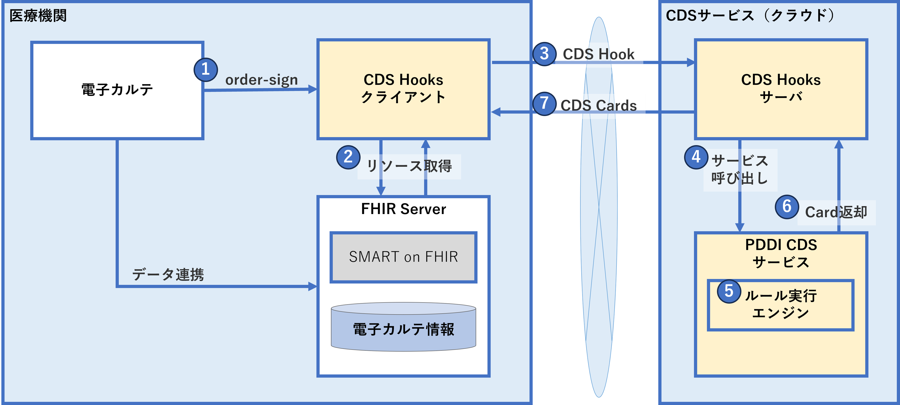

# CDS-HOOKS-SERVER(NeXEHRS-POC)
このプロジェクトは「CDS Hooks(プロトタイプ版)実証」[NeXEHRS-POC](https://www.nexehrs-cpc.jp/)によるCDS実装検証モデルです。

CDS Hookは、ベンダーに依存しないリモート意思決定支援標準です。 このリポジトリは、CDS Hooks プロジェクトの仕様と Web サイトの両方として機能します。


# cds-hooks-proto

<center></center> 

### 機能イメージ・処理フロー
<center></center> 

## [cds-hooks-client](./cds-hooks-client/README.md)
- 動作環境
- フォルダ構成
- 事前準備
- 実行コマンド


## [cds-hooks-server](./cds-server-next-docker/README.md)
- CDSHOOKサーバの開始方法
- 基本仕様・機能概要
- API仕様書
	- 共通仕様
	- /cds-service
	- /order-select
	- /order-sign

## [pddi-cds-service](./pddi-cds-service-proto/README.md)
- PDDI CDSサービス（Docker版）のインストール
	- 事前準備
	- インストール手順
- リクエストAPI
	- アクセスURL
	- リクエストヘッダ
	- リクエストボディ

> [!CAUTION]
>2024-05-10 17:10:23
> Next.js サーバー アクションでサーバー側リクエスト フォージェリ (SSRF) の脆弱性がセキュリティによって特定されました。
> 過去にダウンロードさあれた方はNextバージョンを 14.1.1以降にアップデートする事により解消できます。

Nextバージョンアップ方法
```bash
※ cds-hooks-proto/cds-server-next-docker/cds-hook-server/へ移動します。
>cd cds-hooks-proto/cds-server-next-docker/cds-hook-server/

※ 下記のコマンドでアップデートを実行します。これにより最新版へアップグレートされます。
>npm i next@latest

[確認方法]
cds-hooks-proto/cds-server-next-docker/cds-hook-server/package.jsonを確認して13行目あたりにあるnextと書かれた行でバージョンが確認できます。
例："next": "^14.2.3",
```
