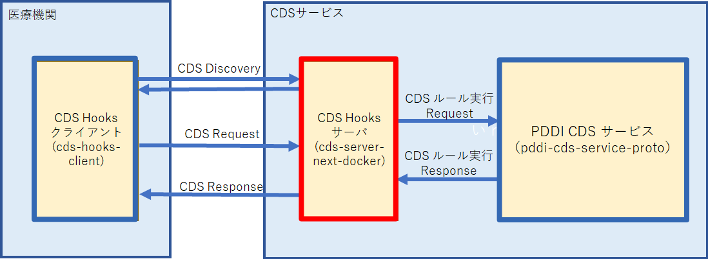

# CDS サービス cds-hooks-server
## cds-hooks-protoにおけるcds-hooks-serverサービスの位置づけ
下図にcds-hooks-proto全体のイメージを示す。このうちcds-hooks-serverサービスは図中の赤枠で示す部分となる。

 

> [!CAUTION]
> 特定の行動のリスクや否定的な結果について助言する。

## CDS Hooks Serverの開始方法

### [Docker仮想コンテナでのビルド方法](./docs/build_docker.md)
Docker仮想コンテナを使ってプロジェクトをビルドします。Dockerを利用する事で様々なOS上で安全にプロジェクトをビルドする事が可能です。

### [ローカル環境でのビルド方法](./docs/build_localhost.md)
Dockerコンテナを利用せずにlocalhost上でプロジェクトをビルドする事も可能です。
この場合、OSインスタンス上にはNode.js(V18) 動作環境が必要になります。

### [接続テスト](./docs/build_test.md)
Postmanを利用したCDSHOOKサーバとのテスト方法を解説します。
アーカイブに含まれるjsonサンプルを取込む事で接続テストが行えます。

## 基本仕様・機能概要
### [CDSサービスとDatabaseの管理](./docs/extention01.md)
CDS DiscoveryにはSQLite(リレーショナルデータベース)が利用されています。こちらにはCDSサービスが利用するデータベースの操作方法を説明しています。

### [Discovary(/cds-selecctの例)](./docs/extention02.md)
CDSクライアントはCDSサービスに対して公開されているDeicoveryエンドポイントを参照します。Discovery エンドポイントには、CDS サービスの説明、いつ呼び出す必要があるか、プリフェッチが要求されるデータなどの情報が含まれます。

### [他ホストCDS実行エンジン(例：PDDI-CDS-Service等)へのリレー方法](./docs/extention05.md)
他ホストにあるPDDI-CDS実行エンジンへのCDSリレー仕様と設定方法。

### [CDSサービスからのFHIRリソースの取得](./docs/extention03.md)
CDS サービスは、CDS クライアントが要求する推奨事項を計算するために特定の FHIR リソースを必要とします。実際のパフォーマンスに問題がなければ、CDS クライアントはコンテキスト データ (現在のユーザー ID や患者 ID など) のみを渡す CDS サービスを起動でき、CDS サービスは CDS クライアントの FHIR API にアクセスするための承認を取得して、リソースを取得できます。

### [CDSサービスの追加方法](./docs/extention04.md)
新しいCDSサービスを追加するには新しいん実行エンジンプログラムを追加実装する必要があります。
新しいプログラムは比較的単純なルールで実装できるようにしていますが、本番環境に移行するまで充分なテストが必要です。

## API仕様書
#### [API共通仕様](./docs/api_000.md)
> #### /cds-service
#### [/cds-service（Didcovery）](./docs/api_001.md)
#### [/cds-service/static-patient-greeter（prefetchなし）](./docs/api_002.md)
#### [/cds-service/static-patient-greeter（prefetchあり）](./docs/api_003.md)

>#### /order-select
#### [order-select/warfarin-nsaids-cds-select](./docs/api_004.md)
ワルファリン (ワルファリンナトリウム 0.5 MG 経口錠剤) と NSAID (ケトロラック トロメタミン 10 MG 経口錠剤) の間の潜在的な薬物相互作用

#### [/order-select/digoxin-cyclosporine-cds-select](./docs/api_005.md)
ジゴキシン (ジゴキシン 0.2 MG 経口カプセル) とシクロスポリン (シクロスポリン 100 MG) の間の潜在的な薬物相互作用

>#### /order-sign
#### [order-sign/warfarin-nsaids-cds-sign](./docs/api_005.md)
ワルファリン (ワルファリンナトリウム 0.5 MG 経口錠剤) と NSAID (ケトロラック トロメタミン 10 MG 経口錠剤) の間の潜在的な薬物相互作用

#### [/order-sign/digoxin-cyclosporine-cds-sign](./docs/api_006.md)
ジゴキシン (ジゴキシン 0.2 MG 経口カプセル) とシクロスポリン (シクロスポリン 100 MG) の間の潜在的な薬物相互作用

