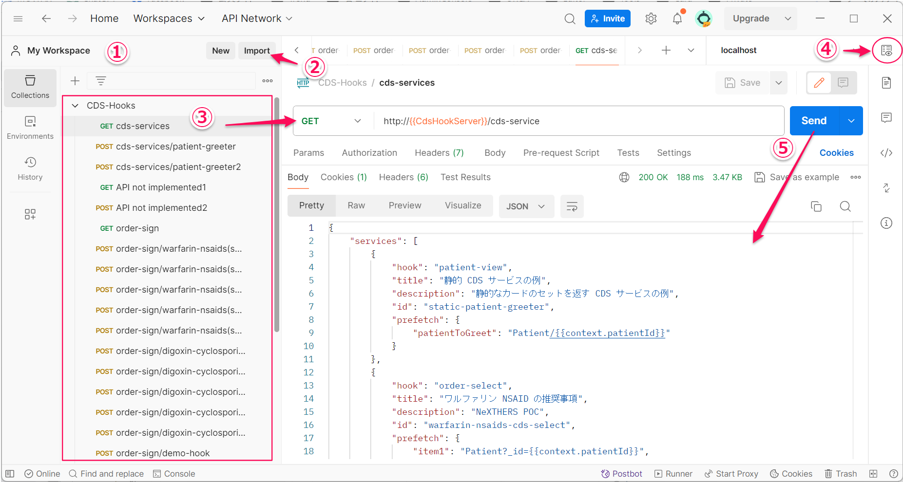

### 接続テスト
ここでは[Postman](https://www.postman.com/)を利用した接続テスト方法を解説します。
アーカイブに含まれるjsonサンプルを取込む事で接続テストが行えます。

#### Postmanのインストール
[Postman公式サイト](https://www.postman.com/)でダウンロード可能です。
インストールする端末のOSとbit数にあったものをダウンロードしてください。　
Postmanの利用を開始するには無料アカウントの登録が必要になります。アカウントをお持ちでない場合は指示に従いアカウントの登録をしてください。

#### サンプルリクエストのインポートとテスト

 
※localhostoでCDS HOOKサーバが起動している状態で行います。

1. 「My Workspace」になっている事を確認。
2. 「import」を選択しアーカイブにある「CDS-Hooks.postman_collection.json」を選択してサンプルリクエストを読み込む
3. サンプルの「cds-services」を選択(CDS-Discovery)
4. 「Send」を送信すると、右下にCDSHOOKサーバからの応答が表示されます。

その他テストサンプルを試行してください。

