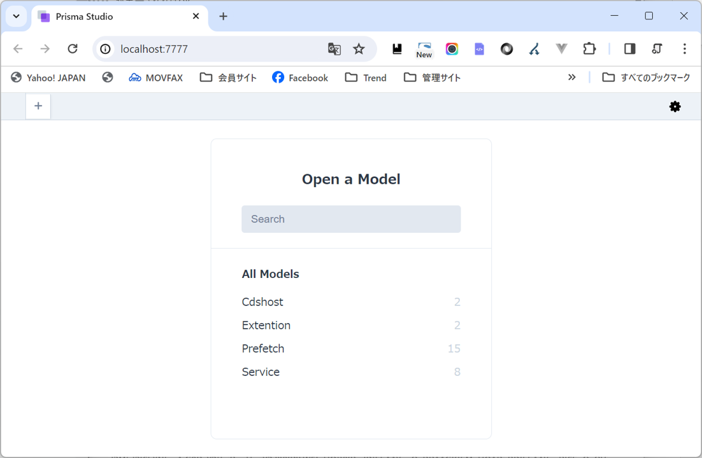
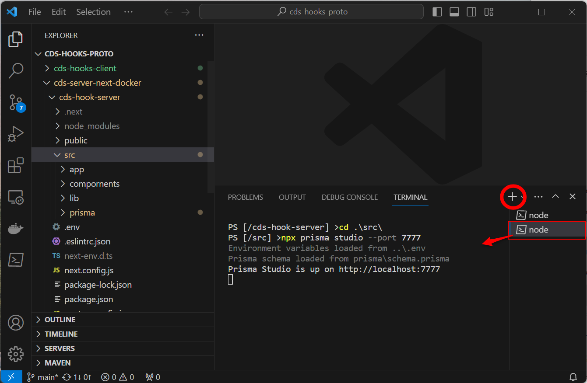

## CDSサービスとDatabaseの管理
本プロジェクトのCDS Discoveryには、はリレーショナルデータベースを利用しています。
後のメンテナンス時（※例えばCDSサービスの追加や削除・編集など）の事を考え、人が視覚的にコントロールできるように採用しました。

### データベースの操作方法
※Dockerコンテナを利用の場合は、[コンテナ内](./build_docker.md#3)で（Docker仮想コンテナでのビルド方法＃３）以下の操作を行ってください。
※ローカル環境でご利用の場合は、新しいターミナルを起動してください。（VSCodeでのやり方は末尾に記載）

1. cds-hook/srcに移動
```bash
[cds-next-on-dokeer]$ cd cds-hook/src/
[src]$
```
2. prisma studioを起動
```bash
[src]$ npx prisma studio --port 7777
Environment variables loaded from .env
Prisma schema loaded from prisma\schema.prisma
Prisma Studio is up on http://localhost:7777
- http://localhost:7777へ接続
- ※--port オプションを外せば5555ポートで起動します。（※Docker仮想コンテナの場合「docker-compose.yml」に記載のPORTS設定の調整が必要です。
```

ブラウザで[http://localhost:7777](http://localhost:7777)に接続しデータベースを操作できます。

操作が完了したら「ctrl」+「C」でprisma studioを停止してください。


   - ***Services*** CDSサービスリストです。このテーブルの[enable=true]リストがDiscovary(/cds-selecct)に対するレスポンスとして返却されます。
   - ***Prefetch*** Servicesに紐づくPrefetchリクエストのリストです。Prefetchは複数のサービスに対して適用できます。
   - ***Extention*** Servicesに紐づくExtentionリクエストのリストです。Extention内容は任意です。
   - ***Cdshost*** Servicesに紐づくCDSリクエストのリレー先ホストを指定します。指定が無い場合はカレントホストで処理を行います。
3. データベース構造。
   
Serviceテーブルを主テーブルとして、PrefetchとExtentionテーブルが1対多の関係で存在します。PrefetchとExtentionが存在する場合それぞれのテーブルのlabelとparametaがkeyとvalueの配列の組合せで返却されます。また、Cdshostに設定がある場合、このCDSサービスは対象レコードに記録されているホストへその内容をリレーします。以下は各テーブルの関連を表したER図です。

  

4. プロジェクト内の構造
データベース本体およびスキーマ（）設定は「src\prisma\schema.prisma」に書かれています。

- cds-next-on-docker\cds-hook\src\prisma\schema.prisma

5. Prisamaによるモデル構築やmigrate方法は以下の通りです。
   
   ※初期化するにはsrc\prisma\以下にある、dev.dbとmigrations/を削除して以下のコマンドを実行してください。但し、既存のテーブル情報は全て失われます。
```bash
[src]> npx prisma migrate dev --name init
```


6. その他

Gitリポジトリから得られるデフォルトアーカイブには軽量のSQLiteを実装していますが、DBMSの種類は何でも構いません。実装のNext.jsフレームワークではPrismaというオープンソースのORM(Object-relational mapping)ツールが利用されていますが、対応できるDBMSはPostgreSQL、MySQL、SQL Server、SQLite（実装済）、MongoDB、CockroachDBなど多種のDBMSが利用できます

[https://www.prisma.io/docs/reference/database-reference/supported-databases](https://www.prisma.io/docs/reference/database-reference/supported-databases)


Prisamaによる詳細は[https://www.prisma.io/](https://www.prisma.io/)を参照してください。


#### VSCodeで新しいターミナルを起動させる方法
「＋」ボタンで新しいターミナルを表示できますので、そこでコマンドを実行してください。

