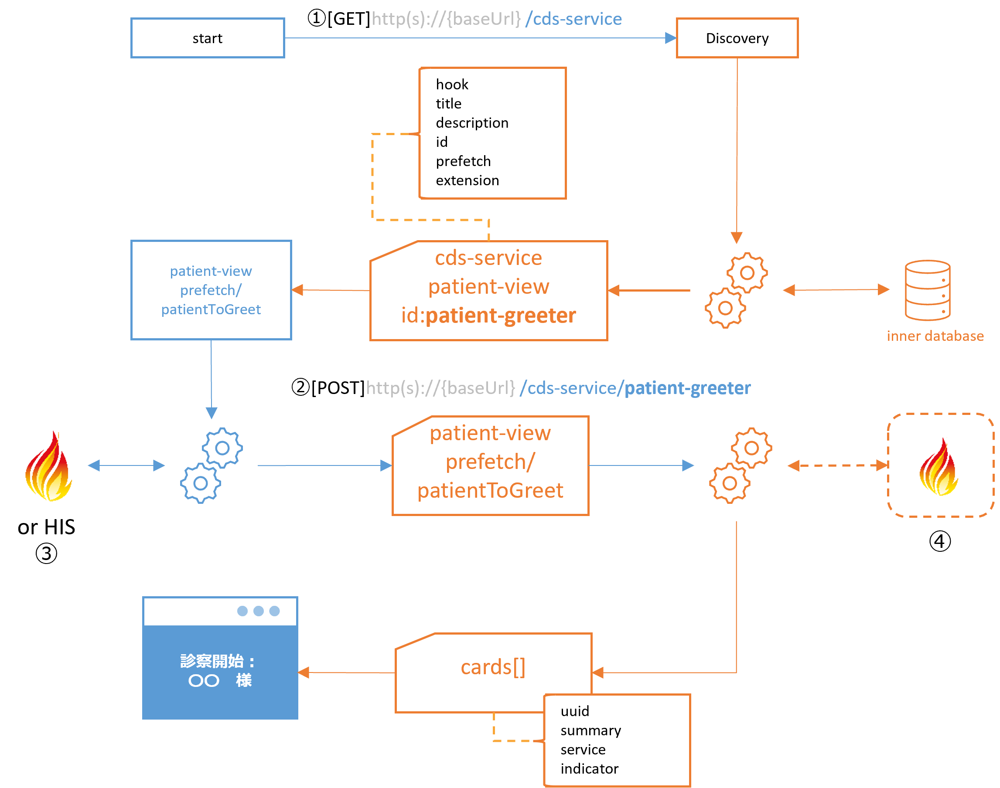

## CDSサービスからのFHIRリソースの取得
CDS サービスは、CDS クライアントが要求する推奨事項を計算するために特定の FHIR リソースを必要とします。実際のパフォーマンスに問題がなければ、CDS クライアントはコンテキスト データ (現在のユーザー ID や患者 ID など) のみを渡す CDS サービスを起動でき、CDS サービスは CDS クライアントの FHIR API にアクセスするための承認を取得して、リソースを取得できます。

<center></center>


以下の例は、 id.static-patient-greeterに応答した場合のCDSサービスのサンプルです。

```bash
DIscoveryによって得られたpatient-viewサービス
{
    "hook": "patient-view",
    "title": "静的 CDS サービスの例",
    "description": "静的なカードのセットを返す CDS サービスの例",
    "id": "patient-greeter",
    "prefetch": {
        "patientToGreet": "Patient/{{context.patientId}}"
    }
}
```

### CDSクライアントは要求されたprefetchを作成せず、代わりにfihrAuthorizationをPOSTした。
-　contextにuserId,patientId,encounterIdはあるが、prefetch.patientToGreetが無いので患者氏名がPOSTデータから判断できない。
-　fhirServerとfhirAuthorizationオブジェクトがあり、指定のFHIRリポジトリにはアクセスできそうである。
```bash
{ 
  "hookInstance" :  "d1577c69-dfbe-44ad-ba6d-3e05e953b2ea" ,
  "fhirServer" :  "https://hapi.fhir.org/baseR4/" ,
  "hook" :  "patient-view" ,
  "fhirAuthorization" :  { 
    "access_token" :  "some-opaque-fhir-access-token" ,
    "token_type" :  "Bearer" ,
    "expires_in" :  300 ,
    "scope" :  "user/Patient.read user/Observation.read" ,
    "subject" :  "cds-service" 
  }, 
  "context" :  { 
    "userId" :  "医師/例" ,
    "patientId" :  "592738" ,
    "encounterId" :  "89284" 
  }
}
```
CDSサービスは受け取ったデータ内に要求したprefetchがみつからず、そのかわりにfhirAuthorizationdの提供があったのでこれを使ってfhirServerにアクセスしPatientリソースを取得した。よって返却されたカードには

"summary": "診察中：Lopez Carniceros",

と患者氏名を特定したカードを返却できた。

```bash
{
    "cards": [
        {
            "summary": "診察中：Lopez Carniceros",
            "indicator": "info",
            "uuid": "dfc61a6b-8555-4cfd-aa1a-ffcf6c77a025",
            "source": {
                "label": "patient-greeter"
            }
        }
    ]
}
```

### CDSクライアントがprefetchを作成した場合の例
CDSサービスはprefetchからこのカードを作成する為に必要な患者情報を参照できるので、fhirServerにアクセスする必要はありません。
```bash
{ 
  "hookInstance" :  "d1577c69-dfbe-44ad-ba6d-3e05e953b2ea" ,
  "fhirServer" :  "https://hapi.fhir.org/baseR4/" ,
  "hook" :  "patient-view" ,
  "fhirAuthorization" :  { 
    "access_token" :  "some-opaque-fhir-access-token" ,
    "token_type" :  "Bearer" ,
    "expires_in" :  300 ,
    "scope" :  "user/Patient.read user/Observation.read" ,
    "subject" :  "cds-service4" 
  }, 
  "context" :  { 
    "userId" :  "医師/例" ,
    "patientId" :  "592743" ,
    "encounterId" :  "89284" 
  },
  "prefetch" :  { 
    "patientToGreet" :  {
        "resourceType": "Patient",
        "id": "592743",
        "meta": {
            "versionId": "1",
            "lastUpdated": "2020-01-27T20:34:01.283+00:00",
            "source": "#FSlQM8Qokn6nKAmW"
        },
        "text": {
            "status": "generated",
            "div": "<div xmlns=\"http://www.w3.org/1999/xhtml\"><div class=\"hapiHeaderText\">Bob <b>ALEXANDER </b></div><table class=\"hapiPropertyTable\"><tbody><tr><td>Date of birth</td><td><span>05 September 2017</span></td></tr></tbody></table></div>"
        },
        "name": [
            {
                "family": "Alexander",
                "given": [
                    "Bob"
                ]
            }
        ],
        "gender": "male",
        "birthDate": "2017-09-05",
        "active": true
    }
  } 
}
```

CDSサービスからの応答例
```bash
{
    "cards": [
        {
            "summary": "診察中：Alexander Bob",
            "indicator": "info",
            "uuid": "cf5ffaa0-078e-494e-a4fd-5e9ce98bebf2",
            "source": {
                "label": "static-patient-greeter"
            }
        }
    ]
}
```