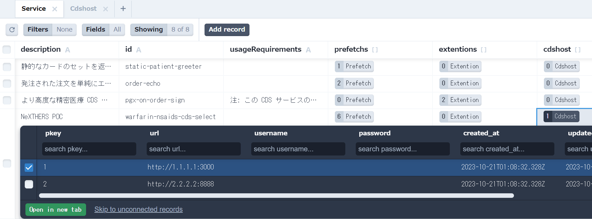

## 他ホスト（CDS実行エンジン）へのリレー方法
このCDSHOOKサーバでは、他ホストによって提供されるPDDI-CDSサービス等の**CDSルール実行エンジン**も利用できます。**CDSルール実行エンジン**はCDSサービスに紐づけて登録したホスト先に転送され、戻り値であるCardをクライアントへ返却します。

### CDSルール実行エンジンの登録
CDSルール実行エンジンは本CDSHOOKサーバ内のサービスを登録したデータベースに記録します。
データベースへの接続方法は[データベースの操作方法](./extention01.md#%E3%83%87%E3%83%BC%E3%82%BF%E3%83%99%E3%83%BC%E3%82%B9%E3%81%AE%E6%93%8D%E4%BD%9C%E6%96%B9%E6%B3%95)を参照してください。

**Service**テーブルは**Cdshost**テーブルを参照する設計になっています。
例えば、**CDShosts**テーブルに以下のように**CDSルール実行エンジン**ホストの登録があるとします。(CDShostテーブルには複数のホストを登録できます)
| url | username | password |
| :---- | :---: | ----: |
| http://1.1.1.1:3000 | **** | **** |
| http://2.2.2.2:8888 | **** | **** |

CDSサービスのうち「**warfarin-nsaids-cds-select**」サービスを他のホストにリレーする場合は**Service#cdshost**カラムに**Cdshost**を１つだけ登録します。
（登録が無い場合はすべて自サーバ内での処理となります。）

この設定によりCDSHOOKサーバは、クライアントから受け取ったCDSリクエストのうち「**warfarin-nsaids-cds-select**」サービスに関しては、全てのリクエスト内容を「**http://1.1.1.1:3000**」にリレーしCardの返却を待機します。

CDSHOOKサーバは、自サーバ内の処理カードと、リレー先からCardを組合せてたものをクライアントに返却します。

つまり、これは単純な転送なのでCDSクライアントがリクエストする「**warfarin-nsaids-cds-select**」サービスに関しては、CDSHOOKサーバではなく**CDSルール実行エンジン**に直接リクエストしても同等の結果が得られるはずです。（接続アクセス権はあると仮定です）

