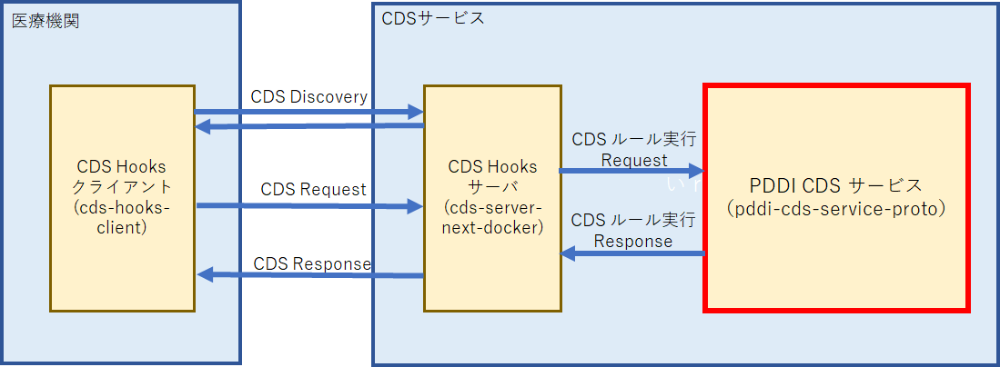

# PDDI CDS サービス pddi-cds-service-proto
## cds-hooks-protoにおけるPDDI-CDSサービスの位置づけ
下図にcds-hooks-proto全体のイメージを示す。このうちPDDI-CDSサービス（pddi-cds-service-proto）は図中の赤枠で示す部分となる。

## PDDI CDSサービス（Docker版）のインストール

### 事前準備
　あらかじめDocker（Windowsで動作するDocker Desktopなど）がインストールされ、利用可能な状態になっていること。
Dockerのインストール方法はWeb上にある解説記事を参照のこと。

### インストール手順

1. pddiCdsServiceの取得
フォルダpddiCdsServiceとDockerFileをダウンロードし、同じフォルダに置く。以下、このフォルダへの絶対パスを\<Folder>と記す。

2. pddiCdsServiceのサービス名設定
フォルダpddiCdsServiceに含まれるbuild.propertiesをテキストエディタで開き、その中の「servlet.name」を設定する。
なお、servlet.nameはCDS Hooks サーバに合わせて、あらかじめ「order-sign」に設定されている。そのままでよければ、build.propertiesは変更せずに次の手順3を実行する。
~~~
　　### Servlet Name
　　servlet.name=order-sign
~~~

3. pddiCdsServiceのビルド実行
端末（Windowsの場合、PowerShellまたはコマンドプロンプト）を起動し、以下を実行する。なおWindowsのPowerShellやコマンドプロンプトの場合下記「$」を「>」に読み替える。以下も同様。
~~~bash
	$ cd <Folder>
	$ docker build -t pddi-cds-service ./
~~~

4. pddiCdsServiceのDockerコンテナ作成、起動
上記 3につづき、以下を実行する。これにより、pddiCdsServiceはDockerのコンテナとして起動する。pddiCdsServiceのAPIは1.3を参照のこと。
~~~bash
	$ docker run -d -p 18080:8080 --name service1 pddi-cds-service:latest
~~~

5. 動作中コンテナの停止、再起動
- 上記 4 で起動したコンテナを停止する場合
下記のコマンドで再起動した場合も同じ
~~~bash
	$ docker stop service1
~~~
- 停止したコンテナを再起動する場合
~~~bash
	$ docker start service1 
~~~

# リクエストAPI
## アクセスURL
~~~text
POST　http://[host]:18080/[serviceName]/[id]
~~~
ただし、
**[host]**：
　pddiCdsServiceを組み込んだDockerコンテナを動かしているマシンのホスト名またはIPアドレス。CDSHooksリクエスト送信元がこのマシンと同一であれば「localhost」を使用してもよい。
**[serviceName]**：
PDDI-CDSサービスのサーバ名。上記インストール手順2でのservlet.nameの設定値となる（servlet.name＝order-signの場合、 [serviceName]＝order-signとなる）。　
**[id]**：
CDSHooksリクエストに応じて以下の値を用いる
- Warfarin＋NSAID, order-signの場合
　[id] = warfarin-nsaids-cds-sign
- Digoxin+Cyclosporine, order-signの場合
　[id] = digoxin-cyclosporine-cds-sign

## リクエストヘッダ
なし
## リクエストボディ
JSON形式のCDSHooksリクエスト

